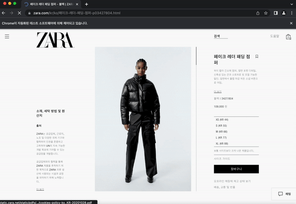
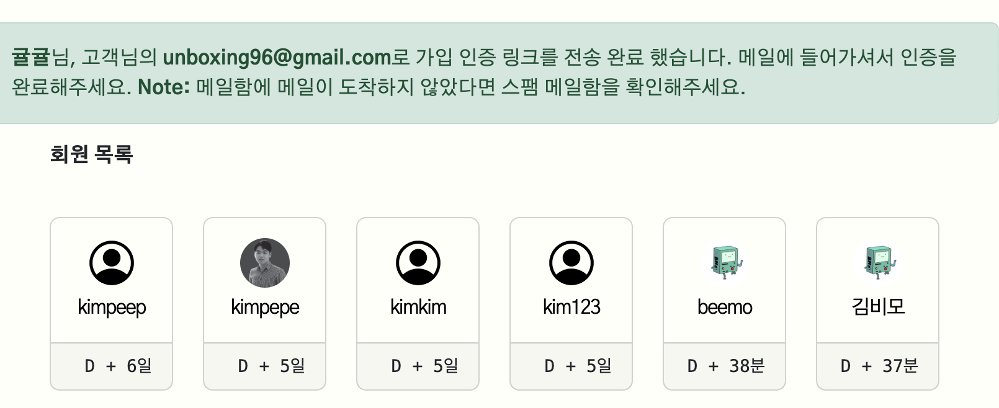

# 세미 프로젝트

- [기획서](기획서.md)
- [회고](회고.md)
<hr>
<br>
<br>
<br>

> ## APP: products
<br>

### 크롤링
__________________


<br>
<br>

> 💡 기본 흐름
1. 필요한 데이터 정리 및 JSON 구조 설계
2. 크롤링으로 데이터 수집
3. 설계에 맞춰 데이터 전처리
4. DB 저장

<br>
<br>

> 💡 상세 흐름

  1. 필요한 데이터 정리 및 JSON 구조 설계
      ```json
      { "gender" : {
        "category": "카테고리 이름",
        "name": "상품 이름",
        "content": "상세 내용",
        "color": "색상 | 품번",
        "price": "가격",
        "size": "사이즈",
        "img_list" : [
          "img_1_url",
          "img_2_url",
          "img_3_url",
          ...
        ]}}
      ```
    
  2. 크롤링으로 데이터 수집

      

  3. 설계에 맞춰 데이터 전처리

      ```python
      ...
      # 딕셔너리 저장: 사이즈
      tmp_size = ""
      for size in sizes:
          st = size.text.replace("\nComing soon", "")
          tmp_size += st + "\n"
      tmp_data["size"] = tmp_size

      # 딕셔너리 저장: 카테고리
      tmp_data["category"] = category

      # 딕셔너리 저장: 이미지 URL 리스트
      tmp = []
      for img in images:
          img = img.find_element(By.TAG_NAME, "source")
          img_list = img.get_attribute("srcset").split()
          tmp.append(img_list[-2])

          tmp_data["img_list"] = tmp
      ...
      ```

  4. DB에 저장
      1. 크롤링으로 생성한 JSON 가져오기
      2. 테이블 생성
          ```python
          ...
          # Product 모델 형식에 맞춰서 입력
          p = Product(
              name=j.get("name"),
              content=j.get("content"),
              color=j.get("color"),
              price=j.get("price"),
              size=j.get("size"),
              gender=g,
              # 카테고리는 Product -> Category 정참조 관계이므로, Category 객체를 할당하여 ID값을 넣어줌
              category=Category.objects.get(sort=j.get("category")),
          )
          p.save()  # 저장
          ...
          ```


<br>
<br>

> ## APP: accounts
<br>

### 이메일 회원가입 인증
__________________
<br>




<br>

<br>
<br>

> 💡 기본 흐름

1. **회원가입**
    1. token 생성 (임시 기간 동안 인증에 사용)
    2. user 정보 **암호화**
2. 암호화된 정보를 **인증 메일**에 담아 보냄
3. **사용자가** 메일 확인하고, **인증 링크 접속**
4. **암호 풀어서**, 사용자 찾아내고, **인증**해주고, 자동 로그인 완료

<br>
<br>

> 💡 상세 흐름
1. 회원가입 
    1. token 생성
        
        ```python
        # accounts/tokens.py
        
        from django.contrib.auth.tokens import PasswordResetTokenGenerator
        import six
        
        # 사용자 정보를 받아, '임시 기간 동안 인증에 사용'되는 '토큰'을 생성
        class AccountActivationTokenGenerator(PasswordResetTokenGenerator):
            def _make_hash_value(self, user, timestamp):
                return (
                    six.text_type(user.pk)
                    + six.text_type(timestamp)
                    + six.text_type(user.is_active)
                )
        
        account_activation_token = AccountActivationTokenGenerator()
        ```
        
    2. user 정보 암호화
          
          ```python
          # accounts/views.py
          
          def signup(request):
            ...

            user = form.save(commit=False)  # 바로 저장 안 하고 user 객체 받아옴
            user.is_active = False          # user의 is_active(인증 여부)를 False로 저장 (default : True)
            user.save()                     # user 정보 저장
            # "이메일 보내기 함수" 만들어서 정보 전달 (request, user 객체, 검증된 데이터["email"])
            activateEmail(request, user, form.cleaned_data.get("email")) 
            
            ...
          ```
          
    3. email 설정
          
          ```python
          # config/settings.py
          
          # 이메일 회원가입 설정
          EMAIL_BACKEND = "django.core.mail.backends.smtp.EmailBackend"
          EMAIL_HOST = "smtp.gmail.com"
          EMAIL_FROM = "****@gmail.com"       # 발신 주소
          EMAIL_HOST_USER = "****@gmail.com"  # 호스트 주소
          EMAIL_HOST_PASSWORD = "**********"  # google에서 발급받은, 이메일 보내기 서비스를 이용하기 위한 2차 비밀번호
          EMAIL_PORT = 587
          EMAIL_USE_TLS = True
          PASSWORD_RESET_TIMEOUT = 14400  # 인증용 메일 만료 시간(초) (4시간)
          ```
      
2. 암호화된 정보를 인증 메일에 담아 보냄
    1. signup form에서 받은 정보를 암호화
    2. accounts/template_activate_account.html에 정보 전달 후 메일 전송
        
        ```python
        # accounts/views.py

        def activateEmail(request, user, to_email):
            # 메일 제목
            mail_subject = "Activate your user account."
            # user 정보(+암호화) 전달 -> accounts/template_activate_account.html
            message = render_to_string(
                "accounts/template_activate_account.html",
                {
                    "user": user.username,
                    "domain": get_current_site(request).domain,
                    "uid": urlsafe_base64_encode(force_bytes(user.pk)),
                    "token": account_activation_token.make_token(user),
                    "protocol": "https" if request.is_secure() else "http",
                },
            )
        ```
        
        
3. 사용자가 메일 확인하고, 인증 링크 접속
    1. 복호화 함수 링크로 연결
        
        
        
    
4. 암호 풀어서, 사용자 찾아내고, 인증해주고, 자동 로그인 완료
    1. user 정보 복호화
    2. 복호화된 pk 값으로 user 객체 찾음
    3. 찾은 user 객체를 is_active=True로 인증시킴
    4. 로그인 후 accounts:index로 redirect


## APP: chat


## Contributors

<a href="https://github.com/sunbongE/PARA/graphs/contributors">
  
</a>


## 후기

- 김태현
  기획 단계를 아주 아주 꼼꼼히 해야 한다고 느꼈습니다.
  새로운 기능을 익힐 때 제일 빠른 건 공식 문서라고 또 한 번 배웠습니다.
  열정 있는 팀원분들 덕분에 잘 마무리 할 수 있었어요. 8조 모두 감사해요 !!


- 박태호: 지난 프로젝트 회고하며 해보고 싶은 기능들이 많았는데 이번에 크롤링, 대댓글, 소셜로그인을 구현해봐서 좋은 경험이었습니다. 댓글, 대댓글 비동기 처리를 진행하면서 React으로 하면 쉽게 구현이 된다는 정보를 들어서 학습하고 싶어졌다. 구현은 했지만 깔끔하지 못한 코드를 보면서 다음 구현에는 더 깔끔하게 해야겠다는 생각을 했다. 팀장으로 역할을 완벽히 소화하진 못했지만 팀원 분들이 다들 책임감을 가지고 맡은 역할을 잘 해주셔서 훈훈한 프로젝트이었습니다. 고생하셨습니다!  


- 손희준: 해시태그에 대한 이해가 늘었다. 해시태그를구성할 때, [.select_related("product")]로 
연관된 DB를 함께 불러오는 게 떠오르지도 않았고 DB를 구성하는데 시간을 많이 잡아 먹었다 


- 류진숙
  : 자라 클론코딩을 해서 프론트는 제법 수월하게 진행할 수 있었던 것 같다. 프론트를 하다보니 추가 기능 구현에 참여하지 못한건 아쉽지만, 프론트를 만지면서 백을 수정해야 할 상황도 있었고, 다른 팀원들의 디버깅을 도와주면서 실력 향상이 될 수 있었던 프로젝트였다. 팀원분들도 기능 구현을 엄청 빠르게 하셔서 이번 프로젝트는 비교적 여유롭게 진행할 수 있었던 것 같다. 다들 최고최고


- 황여원
  첫번재 프로젝트때 해보지 못했던 해시태그, 소셜로그인 등을 할 수 있어서 좋았고 매일 프로젝트를 끝낸 후 자기가 하루동안 구현한 기능을 설명하는 시간을 가져서 다른 팀원들이 진행했던 지도 Api, 크롤링등의 기능을 배울 수 있어서 좋았습니다.


- 송희수: 쿠키로 하는 장바구니 구현이 쉽지않아 오래 걸려서 해보고 싶은 기능들을 못해본거 같다. 또한 비동기처리를 처음 해봤는데 조금 어려웠지만 해볼만한거 같다. 다음에는 해보고 싶은 기능들을 꼭 해보고싶다.
다들 열정적으로 해주셔서 감사합니다. 좋은 인연은 만든거 같네요. 다들 고생하셨습니다.